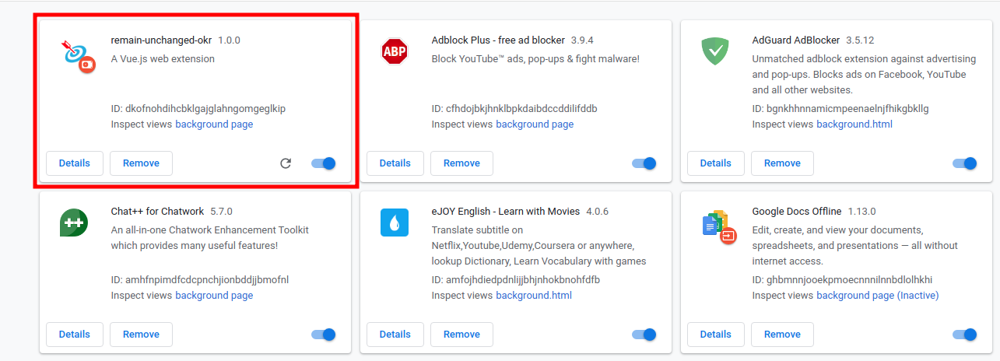

# Extension Automatic Remain Unchanged OKR

Extension will automatically update remain-unchanged every Monday and Sunday. Additionally, users can still update by manually

#### Install and build extension

1. `git clone https://github.com/ngovannghia1997kma/RemainUnchangedOKR.git`

2. `cd RemainUnchangedOKR`

3. `npm install`

4. Test : `npm run watch:dev`

5. build: `npm run build` --> and then steps as `4 - Test`

#### For non-developers

Download the `/dist` directory and do the same as above
